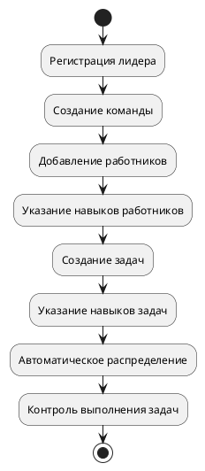
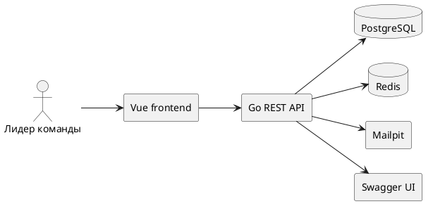
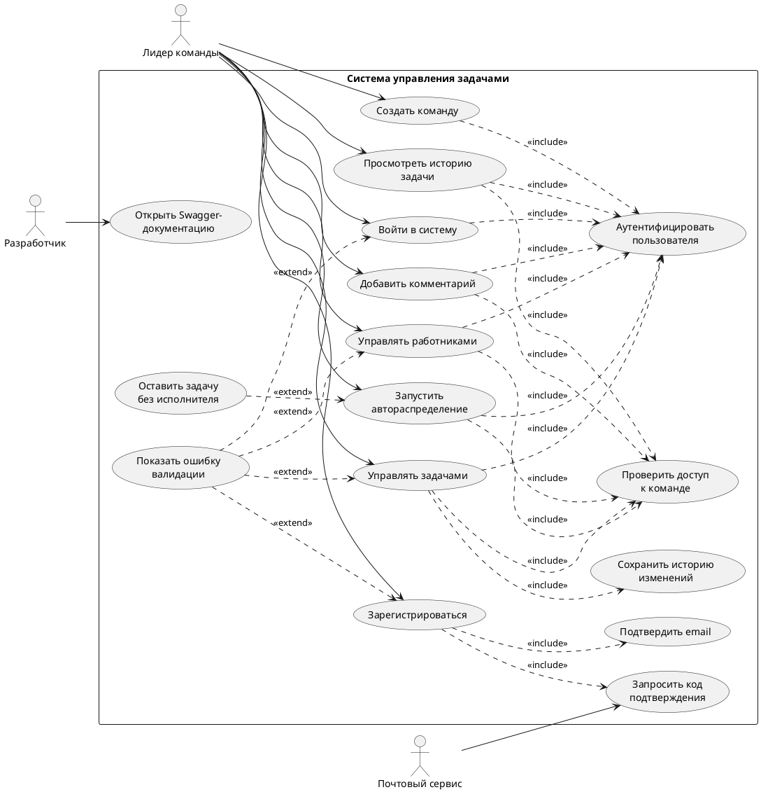
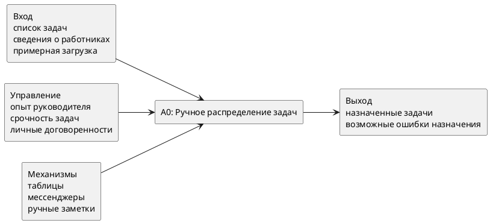
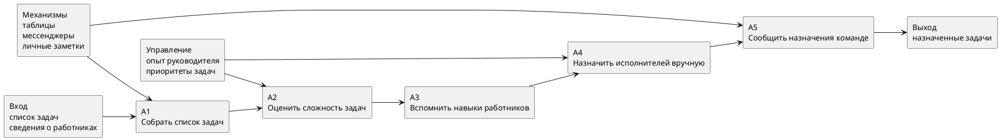
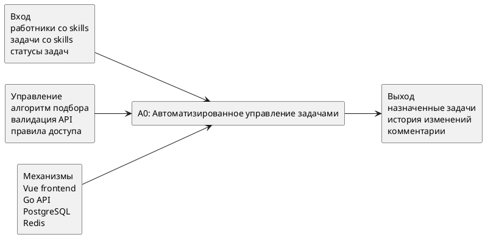
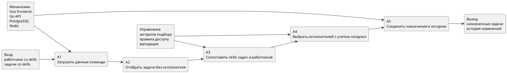
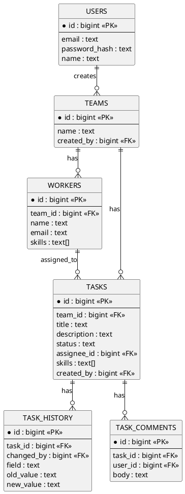
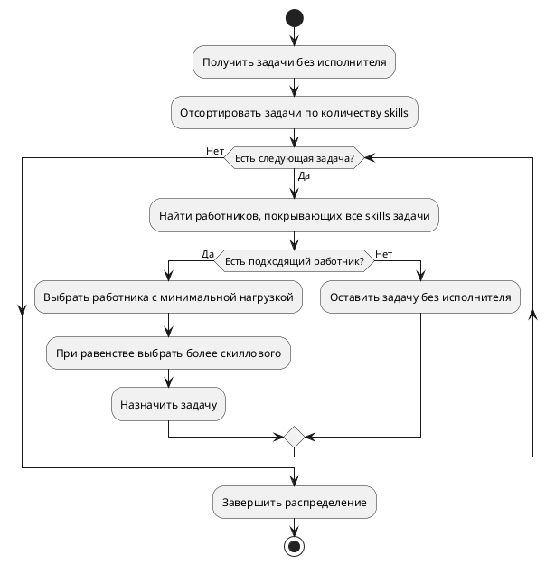

# Отчёт по производственной практике

## Тема

Разработка прототипа веб-приложения для управления задачами команды с автоматическим распределением задач по навыкам работников.

---

# 1. Введение

Целью проекта является разработка прототипа программной системы, предназначенной для управления задачами небольшой команды. Основная идея системы заключается в том, чтобы лидер команды мог создавать работников, задавать их навыки, создавать задачи с требуемыми навыками и автоматически распределять задачи между подходящими исполнителями.

Актуальность проекта связана с тем, что в небольших командах распределение задач часто выполняется вручную. Руководитель должен помнить компетенции сотрудников, учитывать сложность задач и следить за тем, чтобы нагрузка распределялась равномерно. Такой подход может приводить к ошибкам: задача назначается неподходящему исполнителю, один работник получает слишком много задач, а часть задач остается без контроля.

Разрабатываемая система решает эту проблему за счет формального хранения навыков работников и требований задач. При автоматическом распределении система сопоставляет навыки задачи с навыками работников и выбирает наиболее подходящего исполнителя с учетом текущей нагрузки.

Для достижения цели были поставлены следующие задачи:

1. Провести анализ предметной области и аналогичных систем.
2. Сформулировать требования к программному продукту.
3. Разработать техническое задание на прототип.
4. Спроектировать структуру приложения и основные экранные формы.
5. Реализовать прототип веб-приложения.
6. Подготовить диаграммы, описывающие работу системы.

---

# 2. Обзор аналогов. Анализ актуальности. Анализ требований. Выводы

## 2.1 Обзор аналогов

Для анализа предметной области были рассмотрены популярные системы управления задачами: Jira, Trello, Asana и YouTrack. Эти продукты позволяют создавать задачи, назначать исполнителей, отслеживать статусы и организовывать командную работу.

| Система | Основные функции | Преимущества | Недостатки относительно проекта |
|---|---|---|---|
| Jira | Задачи, статусы, исполнители, agile-доски, отчёты | Гибкая настройка процессов, много интеграций | Сложная настройка, автоматическое распределение по навыкам требует дополнительных правил |
| Trello | Канбан-доски, карточки, участники, чек-листы | Простой интерфейс, быстрый старт | Нет строгой модели навыков работников и задач |
| Asana | Проекты, задачи, сроки, исполнители, календарь | Удобное планирование и контроль задач | Нет специализированного подбора исполнителя по нескольким навыкам |
| YouTrack | Задачи, workflow, доски, отчёты | Хорошо подходит для разработки ПО | Автоматизация требует настройки workflow, нет простого сценария skill-based assignment |

## 2.2 Анализ актуальности

Анализ аналогов показывает, что большинство систем хорошо решают задачу общего управления проектами, но не всегда подходят для быстрого и простого распределения задач по навыкам работников. В небольших командах руководителю часто нужен не сложный корпоративный инструмент, а понятная система, которая помогает ответить на практический вопрос: кому лучше назначить конкретную задачу.

Разрабатываемый прототип актуален, потому что:

- хранит навыки работников в структурированном виде;
- позволяет указывать несколько навыков для каждой задачи;
- автоматически сопоставляет задачи и работников;
- учитывает сложность задачи по количеству требуемых навыков;
- снижает риск неравномерного распределения нагрузки;
- сохраняет историю изменений задач и комментарии.

## 2.3 Анализ требований

Основной пользователь системы — лидер команды. Он выполняет регистрацию, создает команду, добавляет работников и управляет задачами.

Основной сценарий работы:

1. Лидер регистрируется и подтверждает email кодом.
2. Лидер входит в систему.
3. Лидер создает команду.
4. Лидер добавляет работников и указывает их навыки.
5. Лидер создает задачи и указывает требуемые навыки.
6. Лидер запускает автоматическое распределение.
7. Система назначает задачи подходящим работникам.
8. Лидер просматривает задачи, историю изменений и комментарии.

## 2.4 Выводы

Существующие аналоги предоставляют широкий набор инструментов для управления проектами, однако специализированный сценарий автоматического распределения задач по навыкам в них либо отсутствует, либо требует дополнительной настройки. Поэтому разработка прототипа системы, ориентированной на лидера команды и skill-based распределение задач, является обоснованной.

---

# 3. Техническое задание

## 3.1 Анализ деятельности заказчика

Условным заказчиком является руководитель небольшой команды разработки. В его обязанности входит планирование работы, постановка задач, контроль исполнения и подбор исполнителей.

До внедрения системы распределение задач может выполняться вручную. Руководитель анализирует список задач, вспоминает навыки работников, оценивает сложность работы и назначает исполнителей. Такой процесс зависит от личного опыта руководителя и может быть неэффективен при росте числа задач.

Проектируемая система должна упростить этот процесс за счет хранения работников, задач и навыков в едином интерфейсе.

## 3.2 Технические требования

### 3.2.1 Аппаратное обеспечение

Для запуска прототипа достаточно персонального компьютера или ноутбука с установленным Docker. Рекомендуемые характеристики:

- процессор с поддержкой виртуализации;
- не менее 8 ГБ оперативной памяти;
- не менее 2 ГБ свободного места на диске.

### 3.2.2 Программное обеспечение

В проекте используются:

- Go — серверная часть;
- PostgreSQL — основная база данных;
- Redis — кеширование;
- Vue — frontend;
- Docker и Docker Compose — запуск окружения;
- Mailpit — тестирование писем с кодом регистрации;
- Swagger — документация REST API.

### 3.2.3 Информационное обеспечение

Основные сущности системы:

- пользователь;
- команда;
- работник;
- задача;
- навык;
- комментарий;
- история изменений задачи.

### 3.2.4 Организационное обеспечение

В системе предусмотрен один тип пользователя — лидер команды. Он отвечает за ведение команды, создание работников, создание задач и запуск автоматического распределения.

## 3.3 Структура прототипа приложения

Прототип состоит из следующих частей:

- web-интерфейс на Vue;
- REST API на Go;
- база данных PostgreSQL;
- кеш Redis;
- сервис Mailpit для проверки email-кодов;
- Swagger UI для просмотра документации API.

Основные страницы приложения:

| Страница | Назначение |
|---|---|
| Вход | Авторизация пользователя |
| Регистрация | Создание пользователя и подтверждение email |
| Задачи | Создание, редактирование, удаление и распределение задач |
| Работники | Создание, редактирование и удаление работников |
| Распределение | Просмотр активности, комментариев и истории задачи |
| Swagger | Просмотр документации API |

## 3.4 Требования к функциональным характеристикам

| Функция | Входные данные | Параметры | Ожидаемый результат | Возможные ошибки |
|---|---|---|---|---|
| Регистрация | Имя, email, пароль | Код подтверждения | Создан пользователь, выдан JWT | Неверный код, email уже используется |
| Вход | Email, пароль | - | Пользователь авторизован | Неверные данные |
| Создание команды | Название команды | - | Команда создана | Пустое название |
| Создание работника | Имя, email, навыки | Список skills | Работник добавлен | Некорректные данные |
| Редактирование работника | ID работника, новые данные | Имя, email, skills | Данные обновлены | Работник не найден |
| Создание задачи | Название, описание, статус, skills | Исполнитель опционально | Задача создана | Неверный статус |
| Редактирование задачи | ID задачи, новые данные | Статус, skills, исполнитель | Задача обновлена, история сохранена | Задача не найдена |
| Автораспределение | ID команды | - | Задачи назначены подходящим работникам | Нет подходящих работников |
| Комментарий | ID задачи, текст | body | Комментарий добавлен | Пустой комментарий |
| Просмотр истории | ID задачи | - | Показана история изменений | Задача не найдена |

## 3.5 Требования к надежности

Система должна:

- хранить пароли в виде хешей;
- использовать JWT для доступа к защищенным endpoint-ам;
- проверять принадлежность пользователя к команде;
- сохранять историю изменений задач;
- корректно обрабатывать ошибочные запросы;
- ограничивать частоту запросов;
- продолжать работу при временной недоступности кеша.

## 3.6 Требования к внешнему виду

Интерфейс должен быть простым и рабочим. Основные требования:

- понятная боковая навигация;
- отдельные страницы для задач, работников и распределения;
- формы создания и редактирования в модальных окнах;
- отображение навыков в виде тегов;
- русские названия статусов задач;
- краткие уведомления по центру экрана;
- отсутствие лишних декоративных блоков, мешающих работе.

## 3.7 Выводы

Техническое задание описывает прототип системы, который покрывает основные действия лидера команды: регистрацию, создание команды, управление работниками, управление задачами и автоматическое распределение задач по навыкам. Требования достаточны для реализации демонстрационного web-приложения.

---

# 4. Проект прототипа программной системы

## 4.1 Диаграмма вариантов использования

Связь `include` используется для обязательных фрагментов, без которых основной вариант использования не является завершенным. Например, защищенные операции включают аутентификацию пользователя и проверку доступа к команде. Связь `extend` используется для условных сценариев: ошибка валидации возникает только при некорректных данных, а задача остается без исполнителя только если при автораспределении не найден подходящий работник.

### Описание вариантов использования

| Вариант использования | Описание |
|---|---|
| Зарегистрироваться | Пользователь вводит данные, получает код на email и подтверждает регистрацию |
| Войти в систему | Пользователь вводит email и пароль, получает JWT |
| Создать команду | Лидер создает одну рабочую команду |
| Управлять работниками | Лидер добавляет, редактирует и удаляет работников |
| Управлять задачами | Лидер создает, редактирует, удаляет и фильтрует задачи |
| Запустить автораспределение | Система назначает задачи работникам по навыкам |
| Просмотреть историю задачи | Лидер видит изменения полей задачи |
| Добавить комментарий | Лидер оставляет комментарий к задаче |
| Открыть Swagger-документацию | Лидер или разработчик просматривает REST API |

## 4.2 Функциональная модель «как есть» в нотации IDEF0

До внедрения системы процесс распределения задач выполняется вручную.

### Декомпозиция модели «как есть»

Декомпозиция процесса A0 показывает, из каких ручных действий состоит распределение задач до внедрения системы.

Недостатки модели «как есть»:

- навыки работников не всегда зафиксированы явно;
- подбор исполнителя зависит от памяти руководителя;
- сложно контролировать равномерность нагрузки;
- история изменений может быть разрозненной;
- часть задач может быть назначена неподходящему исполнителю.

## 4.3 Функциональная модель «как должно быть» в нотации IDEF0

После внедрения системы распределение задач становится автоматизированным.

### Декомпозиция модели «как должно быть»

Декомпозиция процесса A0 показывает, как распределение задач выполняется после внедрения программной системы.

Преимущества модели «как должно быть»:

- навыки работников и задач хранятся структурированно;
- система автоматически подбирает исполнителей;
- сложные задачи обрабатываются раньше;
- нагрузка распределяется более равномерно;
- история изменений сохраняется в системе.

## 4.4 ER-диаграмма

## 4.5 Алгоритм автоматического распределения

Алгоритм оставляет задачу без исполнителя, если ни один работник не обладает всеми требуемыми навыками. Это предотвращает некорректные назначения.

## 4.6 Выводы

Проект прототипа показывает, что система переводит процесс распределения задач из ручного режима в автоматизированный. Диаграммы демонстрируют основную роль лидера команды, структуру данных и принцип работы алгоритма распределения. Прототип соответствует требованиям задания и может быть использован для демонстрации основных функций web-приложения.

---

# 5. Заключение

В ходе производственной практики был разработан прототип web-приложения для управления задачами команды. Система позволяет лидеру команды зарегистрироваться, создать команду, добавить работников, указать их навыки, создать задачи и автоматически распределить их между подходящими исполнителями.

В проекте были использованы Go, PostgreSQL, Redis, Vue, Docker Compose, Mailpit и Swagger. Реализованы REST API, frontend-интерфейс, хранение данных в базе, кеширование, регистрация через email-код, история изменений задач и комментарии.

Главным результатом работы является прототип, наглядно показывающий принципы работы системы: создание команды, ведение работников и задач, учет нескольких навыков и автоматический подбор исполнителей. Разработанная система может быть расширена в дальнейшем: например, можно добавить несколько ролей пользователей, календарное планирование, расширенную аналитику, уведомления и drag-and-drop доску задач.
